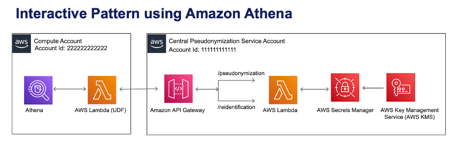

# Solution Overview - Consumption Patterns using Amazon Athena



This consumption pattern shows how you can use the pseudonymization service from Athena for SQL based interactive users.
Athena supports User Defined Functions (UDFs), which allows you to write your business logic in a Lambda function. You
can register and use that UDF in your SQL query like any other SQL function. We will write the logic to call the
pseudonymization service in the Lambda function.

## Demystifying the Lambda UDF

The Athena UDF is an AWS Lambda function using the Java runtime. It consists of following major components:

- A class PseudonymizerUDF that extends UserDefinedFunctionHandler class. The super class is the key that converts this
  Lambda function into an Athena UDF
- A pseudonymize() method that takes a list of plain-text strings that you need to pseudonymize and returns a
  pseudonymized list. It also takes a string value of “true” or “false” to determine whether the pseudonymization should
  be deterministic or not.
- A reidentify() method that takes a list of pseudonymized strings and returns the original list with plain-text strings
- Two helper functions – getStringResponse() to establish HTTP connection with the pseudonymizer API and get the
  response back from the API, getSecret() method to retrieve API access token from AWS Secrets Manager

## Deployment Prerequisites

In order to deploy this solution, we need to fulfil the following additional prerequisites –

- JDK 11 in the local machine where the commands are executed
- Maven in the local machine where the commands are executed
- An IAM Principal to create and execute Athena UDF (This principal will be used to access the Athena Web interface part
  of the AWS Console). Please refer the documentation for more detail.

## Deployment Steps

We create the solution resources via AWS CloudFormation. The solution can be deployed by executing deploy_3.sh script
which can be found inside the deployment_scripts folder. The source code for this pattern can be found here.

Please refer to the list of parameters used in the solution and their descriptions below:

- STACK_NAME - CloudFormation Stack Name
- AWS_REGION - AWS region where the solution will be deployed
- AWS_PROFILE - Named profile that will apply to the AWS CLI command
- ARTEFACT_S3_BUCKET - S3 bucket where the infrastructure code will be stored. (The bucket must be created in the same
  account and same region where the solution lives)
- EP_URL – Endpoint URL of the pseudonymization service
- API_SECRET – API Gateway secret that will be stored in Secrets Manager

Run the following command to deploy the solution:

```shell
sh ./deployment_scripts/deploy_3.sh \
-s <STACK_NAME> \
-b <ARTEFACT_S3_BUCKET> \
-p <AWS_PROFILE> \
-r <AWS_REGION> \
-e <EP_URL> \
-x <API_SECRET>
```

The output should look like the following:


Notice the name of the lambda function as that will be used in the subsequent steps.
The required parameters for the clean-up command are printed out at the end of the execution of the deploy_3.sh script,
make sure to keep these values in a note.

## Testing the solution

Once the above stack is deployed, copy the name of the lambda function thus created so you can use that as an Athena UDF
as shown in queries below. Please note that the pseudonymization API is designed to take array of strings as input to
avoid multiple API calls –

```
USING EXTERNAL FUNCTION pseudonymize(input ARRAY(VARCHAR), deterministic VARCHAR) RETURNS ARRAY(VARCHAR) 
LAMBDA 'LAMBDA_FUNCTION_NAME'
SELECT pseudonymize(ARRAY['string1', 'string2'], 'true');

USING EXTERNAL FUNCTION reidentify(input ARRAY(VARCHAR)) RETURNS ARRAY(VARCHAR) 
LAMBDA 'LAMBDA_FUNCTION_NAME'
SELECT reidentify(ARRAY['MzRlNWU3MWQ5OGNjJcDxz/dg/wDg8T9LE20mH1VvWHorxgk=',
                  'NTM0NTIzNDY4ZmQ16MpQUNXsJv9482OcHZwLRWKygumzK+g=']);
```

If we take the input from the above example of batch consumption pattern and try to use the Athena UDF then the query
would look like this –

```
USING EXTERNAL FUNCTION reidentify(input ARRAY(VARCHAR)) RETURNS ARRAY(VARCHAR) 
LAMBDA 'LAMBDA_FUNCTION_NAME'
SELECT t.dept_id, reidentify(ARRAY_AGG(t.s_vin))
FROM (SELECT dept_id, s_vin FROM blog_batch_db.pseudo_table) t
GROUP BY t.dept_id;
```

## Cleanup

To destroy the resources, please run the following command:

```shell
sh ./deployment_scripts/cleanup_3.sh \
-s <STACK_NAME> \
-b <ARTEFACT_S3_BUCKET> \
-p <AWS_PROFILE> \
-r <AWS_REGION>
```

## Athena UDF pattern performance

Athena only supports scalar UDFs, which process one row at a time and return a single column value. The performance of
this pattern is limited by size of lambda payload when the UDF lambda is called and number of concurrent calls made by
Athena to UDF lambda. From the previously created pseudo_table, follwing is a sampled observation of performance for a
given dept_id and limiting number of vins belonging to that department. On running the following query, we can
understand how the pattern performs as we gradually increase number of pseudo-vins to be reidentified.

```
USING EXTERNAL FUNCTION reidentify(input ARRAY(VARCHAR)) RETURNS ARRAY(VARCHAR)
LAMBDA 'athena-blog-pii-LambdaFunction-GTf7phTkN1OB'
WITH dataset AS(
SELECT dept_id, s_vin FROM blog_batch_db.pseudo_table WHERE dept_id = '31' LIMIT 5000
)
SELECT dept_id, reidentify(grouped_s_vins) AS vins FROM
(SELECT dept_id, ARRAY_AGG(s_vin) AS grouped_s_vins FROM dataset GROUP BY dept_id)
```

| Number of SVINs converted to VINs	 | Approx. Query Run Time	 | Number of Concurrent Lambda Execution | Comment                                                        |
|------------------------------------|------------------------|---------------------------------------|----------------------------------------------------------------|
| 5000	                              | 5.626 sec	             | 1	                                    | Concurrent UDF lambda execution because the query has only row |
| 50000	                             | 8.014 sec	             | 1	                                    | Concurrent UDF lambda execution because the query has only row                                                                                                                              |
| 80000	                             | 9.543 sec	             | 1	                                    | Concurrent UDF lambda execution because the query has only row                                                                                                                              |
 10000	                             | -	| -	                                    | Query errors out because the size of request to Lambda UDF exceeds the lambda payload limit. Error message  - "Request must be smaller than 6291456 bytes for the InvokeFunction operation" |

If we include more than one department in above query then for each group of SVINs belonging to a department, UDF lambda
is called concurrently n number of times where n is total number of departments. For e.g., following query would result
in 3 concurrent executions of UDF, one for each row/department. This behaviour also depends on available concurrency for
that lambda function.

```
USING EXTERNAL FUNCTION reidentify(input ARRAY(VARCHAR)) RETURNS ARRAY(VARCHAR)
LAMBDA 'athena-blog-pii-LambdaFunction-GTf7phTkN1OB'
WITH dataset AS(
(SELECT dept_id, s_vin FROM blog_batch_db.pseudo_table WHERE dept_id = '31' LIMIT 5000)
UNION ALL
(SELECT dept_id, s_vin FROM blog_batch_db.pseudo_table WHERE dept_id = '16' LIMIT 5000)
UNION ALL
(SELECT dept_id, s_vin FROM blog_batch_db.pseudo_table WHERE dept_id = '24' LIMIT 5000))
SELECT dept_id, reidentify(grouped_s_vins) AS vins FROM
(SELECT dept_id, ARRAY_AGG(s_vin) as grouped_s_vins FROM dataset GROUP BY dept_id)
```


